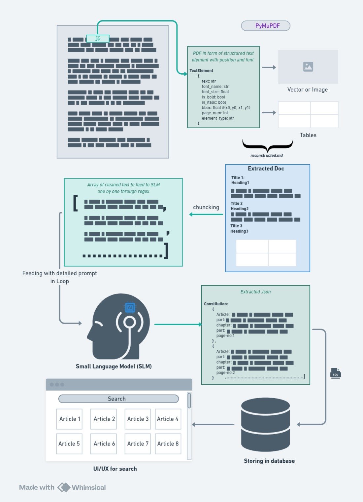
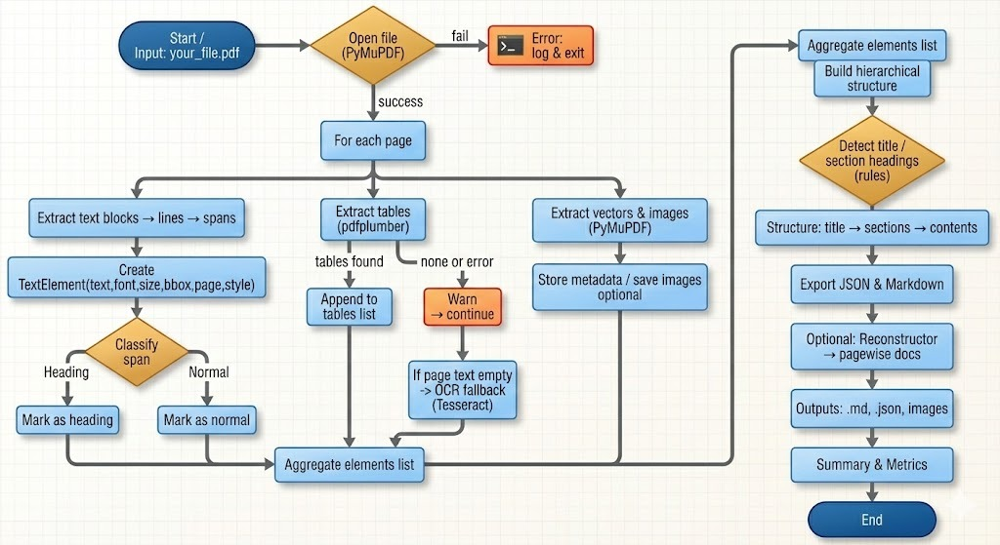
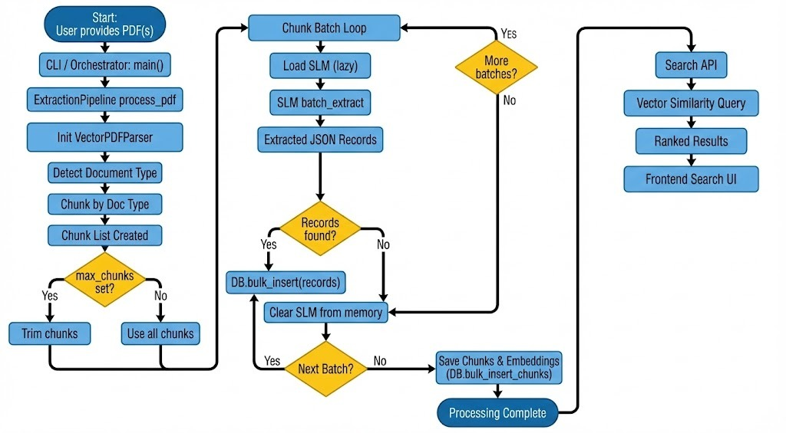

# Intelligent PDF Extraction & Search Pipeline (Variant E)

---

## 📄 Project Overview

This project implements an end-to-end pipeline that ingests complex, long-form PDFs (such as the Indian Constitution, Engineering Textbooks, and Utility Reports), converts them into structured data using a Small Language Model (SLM) and Vector-based PDF Parsing, and stores them in a searchable SQLite database.

This solution corresponds to Variant E of the assignment:

- **SLM:** Energy-efficient Small Language Model (optimized for local CPU/GPU inference).
- **Parser:** Vector-based extraction (PyMuPDF) to handle layout, fonts, and tables.
- **Storage/UI:** SQLite Database Notebook exploration.

---

## System Architecture

The pipeline follows a structured approach: **Ingest ⮕ Chunk ⮕ SLM Extraction ⮕ Storage**.

<p align="center">
  
</p>

---


### Key Features
* **Vector PDF Parser:** Uses `PyMuPDF` and `pdfplumber` to extract text, fonts, tables, and bounding boxes, distinguishing between headers and body content.
* **Local SLM Extraction:** integrated with **Ollama (Phi-3)** to extract strict JSON structures (e.g., Articles, Theorems) without external API costs.
* **Hybrid Search:** Combines SQL-based filtering (by document type, chapter) with Vector Semantic Search (using `sentence-transformers`).
* **OCR Fallback:** Automatically triggers `Tesseract OCR` for scanned or low-quality pages.
* **Interactive UI:** A Jupyter Notebook interface (`Document_Extraction_Search_UI.ipynb`) for querying the database.

---

## 🔄 Workflow & Logic 
1.  **Ingestion & Parsing (`extract_pdf.py`):**
    * Analyzes font sizes and styles to identify hierarchy (Headings vs. Normal Text).
    * Extracts tables using `pdfplumber`.
    * Generates embeddings for text chunks using `all-MiniLM-L6-v2`.

<p align="center">
  
</p>
    

2.  **Orchestrator (`pipeline.py`):**
    * Manages memory and batch processing.
    * Lazy-loads the SLM to prevent memory overflows.
    * Classifies document types (`constitution`, `mathematics`, `utility`) and applies specific regex cleaning.
  
<p align="center">
  
</p>

3.  **Storage (`load_db.py`):**
    * Stores structured records and vector embeddings in SQLite (`data/documents.db`).

4.  **Search & Exploration (`Document_Extraction_Search_UI.ipynb`):**
    * Provides widgets to filter by document type and perform natural language queries.

---

## 📂 Project Structure

```bash
├── data/
│   ├── raw_pdfs/           # Input PDFs (Constitution, Math, Utility)
│   └── documents.db        # SQLite Database (generated)
├── assets/                 # Diagrams for README
├── extract_pdf.py          # VectorPDFParser class (PyMuPDF logic)
├── run_slm.py              # ExtractionSLM class (Model inference)
├── load_db.py              # DocumentDatabase class (SQLite ops)
├── pipeline.py             # Main orchestration script (provided in prompt)
├── requirements.txt        # Python dependencies
└── README.md               # Documentation
```
---
## Setup & Installation

### Prerequisites

- Python 3.9+
- Ollama installed
- Phi-3 model
---

### Local Setup

#### Clone the repository:

```bash
git clone <repo-url>
cd pdf-extraction-pipeline
```
### Install Dependencies:

```bash
pip install -r requirements.txt
```
###
Key libraries: pymupdf, torch, transformers, sqlite3.

### Place PDFs:

Ensure your target PDFs are located in `data/raw_pdfs/`

---
## 💻 Usage

### Running the Extraction Pipeline

To process the PDFs and populate the database, run the main pipeline script. The script includes memory management (garbage collection) and batch processing to handle large files on limited hardware.

```bash
python pipeline.py
```
### Configuration

You can modify `pipeline.py` to change batch sizes or limit chunks for testing:

```python
# Inside pipeline.py
pdfs_to_process = [
  {"path": "data/raw_pdfs/constitution.pdf", "type": "constitution", "max_chunks": 10},
   # ...
]
```
### Running the Search UI

Launch the search interface to explore the extracted data.

Using the Jupyter exploration mode (Variant E specific):

```bash
jupyter notebook explore_data.ipynb
```
---

## ⚡ Performance & Optimization

- **Lazy Loading:** The SLM is only loaded into memory when a batch is ready to be processed (`_ensure_slm_loaded`).

- **Batching:** Chunks are processed in batches (default: 3) to prevent CUDA OOM errors.

- **Garbage Collection:** Explicit `gc.collect()` and `torch.cuda.empty_cache()` calls ensure memory is freed between batches.
